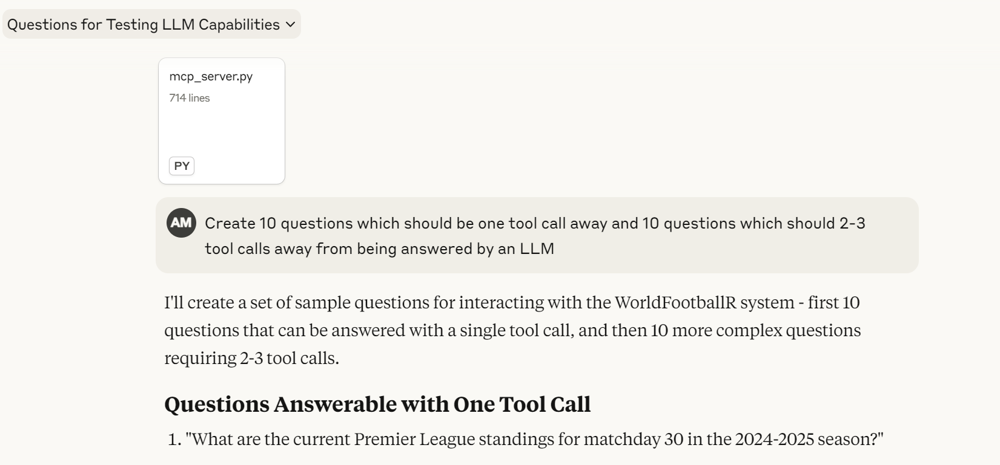
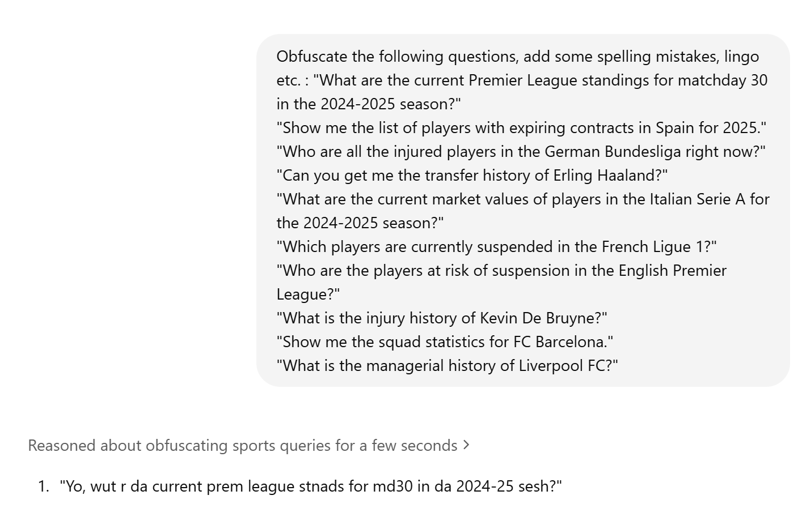

# Question Creation Philosophy

## Set-1: Anthropic-Created (One Shot and Two Shot).
- Provide the `mcp_server.py` file to anthropic.
- Ask to generate questions like this.

## Set-2: Hard Questions generated by ChatGPT-reasoning.
- Here is the [conversation log](https://chatgpt.com/share/67fb5e3b-2ba8-800e-a131-a4602b01d9dc)
- There are two intentions:
  - Hide the interface of the `mcp server`, if the server cannot answer based on it's tools, that a valid response.
  - Make it hard and lengthy to assess how good of a translation engine both `mcp server` and `perplexity` can be.

## Set-3: Anthropic one-shot but obfuscated (by ChatGPT-reasoning).
- Adding slangs, using nicknames for proper nouns etc. [logs](https://chatgpt.com/share/67fb60e2-3034-800e-b026-cfd6e49417f7)
